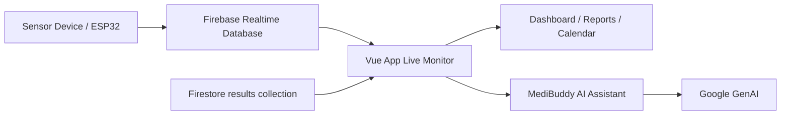

<div align="center">

# CardioMetrics
### Real-Time AI-Enhanced ECG Monitoring and Management

<p>
  
  
  
  
  
</p>

<p>
CardioMetrics is a modern health dashboard that combines real-time heart monitoring, historical analytics, alert workflows, and an AI assistant in one interface.
</p>

</div>

---

## Quick Navigation

- [Why CardioMetrics](#why-cardiometrics)
- [What You Can Do](#what-you-can-do)
- [Live Product Walkthrough](#live-product-walkthrough)
- [Architecture and Data Flow](#architecture-and-data-flow)
- [Getting Started](#getting-started)
- [Reproduce Everything Step by Step](#reproduce-everything-step-by-step)
- [Configuration](#configuration)
- [Troubleshooting](#troubleshooting)
- [Security and Medical Disclaimer](#security-and-medical-disclaimer)
- [Roadmap](#roadmap)

---

## Why CardioMetrics

Many ECG projects stop at basic charting. CardioMetrics goes further by delivering:

- Real-time BPM and ECG-like waveform visualization
- Automatic heart-rate status classification
- Historical analytics and trend filtering
- Alerting and emergency workflow (SOS)
- AI assistant for interpretation and guided actions

This makes it useful for demos, student projects, prototyping, and research workflows.

---

## What You Can Do

### 1) Live Monitoring
- Watch BPM updates from live sensor stream
- See ECG-like waveform from raw signal data
- Instantly detect state: Bradycardia, Normal, Tachycardia

### 2) Alerts and Safety Actions
- Detect abnormal heart-rate events using thresholds
- Show warning overlays with actionable status
- Trigger SOS emergency mode with automatic clinical snapshot export

### 3) Analytics and Reporting
- Review recent entries and full measurement history
- Search historical records quickly
- Analyze status distribution and key statistics
- Filter trend chart by `1h`, `Today`, `7d`, `15d`, `30d`

### 4) AI Clinical Assistant (MediBuddy)
- Ask for plain-language summaries of your data
- Request trend or distribution explanations
- Navigate to app sections by natural language
- Set custom thresholds in chat

---

## Live Product Walkthrough

Use this as a guided tour after startup.

- Open Dashboard tab:
  - Verify live status badge changes with incoming data
  - Confirm animated pulse and waveform are active
- Open Reports tab:
  - Check total records, average BPM, min/max BPM
  - Validate distribution bar and full log table
- Open Calendar tab:
  - Select days with records
  - Inspect selected-day details
- Open AI panel:
  - Ask summary, trend, and navigation questions

<details>
<summary><strong>Try these assistant prompts</strong></summary>

- `Can you summarize my recent heart rate readings?`
- `Show me status distribution breakdown`
- `Take me to reports`
- `Alert me if my heart rate goes above 120`
- `Alert me if my heart rate goes below 55`
- `TRIGGER SOS`

</details>

---

## Architecture and Data Flow



### Runtime Data Sources

- Realtime Database paths:
  - `realtime/bpm`
  - `realtime/signal`
- Firestore collection:
  - `results`

### Status Logic

- Bradycardia: BPM < 60
- Normal: 60 <= BPM <= 100
- Tachycardia: BPM > 100

---

## Getting Started

### Prerequisites

- Node.js 18 or newer (LTS recommended)
- npm 9 or newer
- Firebase project with RTDB and Firestore enabled
- Optional: Google AI API key for assistant features

### Install and Run

```bash
npm install
npm run dev
```

### Build and Preview

```bash
npm run build
npm run preview
```

---

## Reproduce Everything Step by Step

### Step A: Enable AI Assistant

Create a local env file in project root:

```env
VITE_GEMINI_API_KEY=your_gemini_api_key_here
VITE_FIREBASE_API_KEY=your_firebase_api_key_here
```

Restart dev server after creating or updating env values.

### Step B: Reproduce Live Monitoring

In Firebase Realtime Database, set:

- `realtime/bpm` to values such as `72`, `95`, `120`, `52`
- `realtime/signal` to changing values (for example `350` to `700`)

Expected result:

- BPM number updates in real time
- Status changes between Normal/Tachycardia/Bradycardia
- Waveform updates continuously while signal changes

### Step C: Reproduce Historical Analytics

Insert documents into Firestore collection `results` with fields:

```json
{
  "bpm": 78,
  "status": "Normal",
  "timestamp": 1714300000000
}
```

Expected result:

- Recent entries cards are populated
- History table and search are functional
- Reports metrics and chart data update
- Calendar highlights days with data

### Step D: Reproduce Abnormal and SOS Flow

- Set `realtime/bpm` above high threshold (default 110) or below low threshold (default 55)
- Confirm alert overlay and warning sound
- Trigger SOS using chat keyword `TRIGGER SOS`

Expected result:

- Emergency overlay appears
- Clinical snapshot text file is exported

---

## Configuration

### Firebase

The app currently initializes Firebase in `src/App.vue` and `src/firebase.js`.

If you migrate to your own Firebase project:

1. Set `VITE_FIREBASE_API_KEY` in your local env file
2. Ensure RTDB and Firestore rules allow your test flow
3. Keep data paths and field formats consistent with this README

### Expected Schema

<details>
<summary><strong>Realtime Database schema</strong></summary>

Path: `realtime/bpm`

```json
78
```

Path: `realtime/signal`

```json
512
```

Notes:

- `bpm` should be numeric
- `signal` should be integer-like in range 0..1023

</details>

<details>
<summary><strong>Firestore schema</strong></summary>

Collection: `results`

```json
{
  "bpm": 78,
  "status": "Normal",
  "timestamp": 1714300000000
}
```

Accepted timestamp formats in current app logic:

- Number epoch milliseconds
- Firestore Timestamp via `toMillis()`
- Fallback numeric `createdAt`

</details>

---

## Scripts

- `npm run dev`: start local development server
- `npm run build`: build production bundle
- `npm run preview`: preview production build locally

---

## Troubleshooting

<details>
<summary><strong>Assistant says API key is missing</strong></summary>

- Confirm `.env.local` exists at project root
- Confirm key name is exactly `VITE_GEMINI_API_KEY`
- Restart development server

</details>

<details>
<summary><strong>Firestore permission denied</strong></summary>

- Verify Firestore security rules
- Verify app points to the correct Firebase project
- Check that `results` documents have valid fields

</details>

<details>
<summary><strong>No live signal in dashboard</strong></summary>

- Verify RTDB paths are exactly:
  - `realtime/bpm`
  - `realtime/signal`
- Ensure `realtime/signal` keeps changing (not a single static value)

</details>

<details>
<summary><strong>Reports look empty</strong></summary>

- Insert enough records in Firestore `results`
- Ensure `bpm` is numeric
- Ensure `timestamp` is valid and parseable

</details>

---

## Security and Medical Disclaimer

- Do not commit private keys or sensitive credentials
- This software is intended for educational and prototype purposes
- It is not a certified medical device and does not replace professional medical judgment

---

## Roadmap

- Move Firebase config to env variables
- Add authentication and per-user data isolation
- Split large app logic into composables/services
- Add unit and integration tests
- Add CI pipeline and deployment docs

---

## License

This project is licensed under the MIT License. See `LICENSE` for details.
